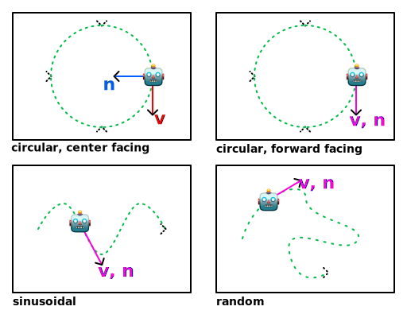

# ECE 4271 Final Project: Visualizing Kalman Filters
**Lucas Plant, Shranav Palakurthi**

## Abstract
The objective of this project is to provide a live demonstration of Kalman filters as applied in the real world, allowing students to build an intuition of the filter's properties and what it does. Our proposed system consists of a 2D rigid-body simulation, a sensor simulation, an Extended Kalman Filter (EKF) state estimator, and a visualization system. By analyzing the convergence and statistical properties of the EKF for rigid body motion through Monte Carlo simulation, the project visualizes ground-truth trajectories, estimated trajectories, and the resulting distributions to make these complex mathematical concepts highly accessible.

## Background
Kalman filters[^1] are a cornerstone in practical signal processing and have found numerous applications in systems that operate under real-world constraints, such as noise and missing measurements. Despite this ubiquity, Kalman filters are still a subject that many students lack a basic understanding and intuition about, in both implementation and inference. 

This project addresses this educational gap by providing a live, modular demonstration of Kalman filters in a simulated environment, allowing users to build a concrete understanding of what the filter does. The decision to simulate an agent in 2D ($\text{SE}(2)$) instead of 3D ($\text{SE}(3)$) was deliberately made to maintain focus on the filter's core properties, avoiding the relative complexity of nonlinearities introduced with respect to 3D orientation.

## Methodology
Our solution is built in Python and divided into modular components to allow for Monte Carlo evaluation of multiple methods decoupled from the visualization frontend. 

### Robotics Model
The 2D rigid-body simulator tracks and updates the ground-truth state of a simulated robot in $\text{SE}(2)$ space, storing $x$, $y$, and $\theta$ in a state vector. Additionally, the simulator generates measurements from two data sources polluted with random noise drawn from a Gaussian distribution:
- **IMU Data**: Measures linear acceleration ($d^2x/dt^2$, $d^2y/dt^2$) and angular velocity ($d\theta/dt$).
- **GPS Data**: Measures absolute position ($x$, $y$) at a lower rate.

### State Estimator
The standard Kalman Filter defines optimal update and propagation steps for linear systems subject to Gaussian noise[^1]. The EKF extends this concept to nonlinear systems by linearizing about the current mean[^2]. It consumes the noisy sensor data to form a statistically optimal estimate of the rigid body's position, using the IMU data for the propagation step and the GPS data for the update step.

**Fig. 1:** A Visualization of the simulator robot paths. $\vec{v}$ is the robot velocity, $\vec{n}$ is the heading.

## Software Architecture
To execute the Monte Carlo trials efficiently, the codebase is completely vectorized using NumPy arrays, allowing $n$ parallel trials to run simultaneously without Python loop overhead. The architecture is divided into multiple core modules:

- **Core Simulation (`sim.py`)**:
    - Defines $\text{SE}(2)$ transformations for rigidbody pose storage and provides data containers to store trajectories for later processing.
    - Defines a rigidbody simulator based on an RK4 integrator that generates ground-truth paths to be corrupted with noise.
- **State Estimator (`EKF.py`)**:
    - Defines the EKF, which manages a 5D state vector based on simulation data and implements efficient updates via vectorized math.
- **Visualizer (`plot_utils.py`)**:
    - An abstraction layer using Plotly to generate consistent visualizations, including static trajectories, animated playbacks, and statistical plots with $\pm1\sigma$ confidence bounds from the EKF.
- **Utility Scripts (`run_demo.py`, `kf_demo.py`)**:
    - A collection of scripts that allow for repeated visualization and testing across multiple motion profiles like circular orbits and sinusoids.

## Results
By fusing high-rate noisy IMU data with lower-rate GPS updates, the Extended Kalman Filter successfully tracked non-linear rigid body motion in $\text{SE}(2)$ space. The visualization dashboards fulfilled the primary objective of the project by graphically mapping the statistical properties, covariance spread, and convergence of the filter across repeated trials. These intuitive visualizations serve as a strong educational tool. While the standard EKF proved capable, future iterations of this system could implement the Invariant EKF using the exponential map to completely sidestep the divergence risks associated with 1st-order linearization.

[^1]: A New Approach to Linear Filtering and Prediction Problems, R.E. Kalman
[^2]: The Unscented Kalman Filter for Nonlinear Estimation, Eric A. Wan, Rudolph van der Merwe